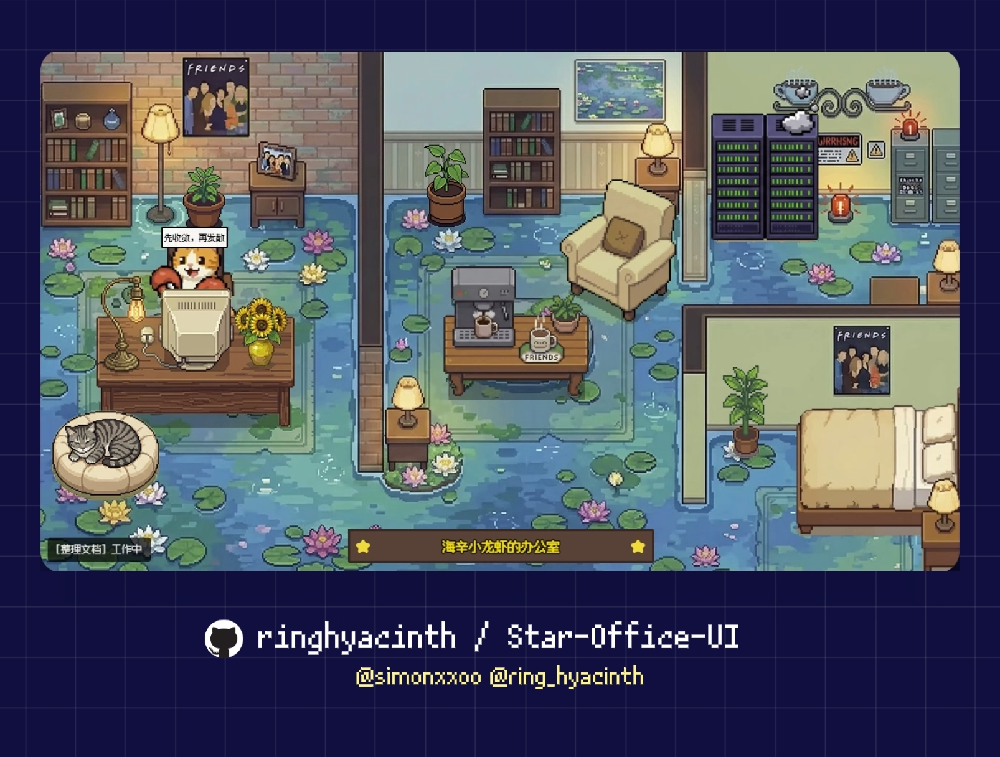

# Star Office UI

🌐 Language: [中文](./README.md) | [English](./README.en.md) | **日本語**



**ピクセルアート風 AI オフィスダッシュボード** —— AI アシスタントの作業状態をリアルタイムで可視化し、「誰が何をしているか」「昨日何をしたか」「今オンラインか」を直感的に把握できます。

マルチ Agent 協調、中英日 3 言語、AI 画像生成による模様替え、デスクトップペットモードに対応。
[OpenClaw](https://github.com/openclaw/openclaw) との統合で最高の体験が得られますが、単体でもステータスダッシュボードとして利用可能です。

> 本プロジェクトは **[Ring Hyacinth](https://x.com/ring_hyacinth)** と **[Simon Lee](https://x.com/simonxxoo)** の共同制作（co-created project）であり、コミュニティの開発者（[@Zhaohan-Wang](https://github.com/Zhaohan-Wang)、[@Jah-yee](https://github.com/Jah-yee)、[@liaoandi](https://github.com/liaoandi)）とともに継続的にメンテナンス・改善を行っています。
> Issue や PR を歓迎します。貢献してくださるすべての方に感謝いたします。

---

## ✨ クイックスタート

### 方法 1：ロブスターにデプロイしてもらう（OpenClaw ユーザー向け）

[OpenClaw](https://github.com/openclaw/openclaw) をご利用中なら、以下のメッセージをロブスターに送るだけ：

```text
この SKILL.md に従って Star Office UI をデプロイしてください：
https://github.com/ringhyacinth/Star-Office-UI/blob/master/SKILL.md
```

ロブスターが自動的にリポジトリのクローン、依存関係のインストール、バックエンドの起動、ステータス同期の設定を行い、アクセス URL をお知らせします。

### 方法 2：30 秒手動セットアップ

> **Python 3.10+ が必要です**（コードベースは `X | Y` ユニオン型構文を使用しており、3.9 以前のバージョンではサポートされていません）

```bash
# 1) リポジトリをクローン
git clone https://github.com/ringhyacinth/Star-Office-UI.git
cd Star-Office-UI

# 2) 依存関係をインストール（Python 3.10+ が必要）
python3 -m pip install -r backend/requirements.txt

# 3) 状態ファイルを初期化（初回のみ）
cp state.sample.json state.json

# 4) バックエンドを起動
cd backend
python3 app.py
```

**http://127.0.0.1:19000** を開き、状態を切り替えてみましょう：

```bash
python3 set_state.py writing "ドキュメント整理中"
python3 set_state.py error "問題を検出、調査中"
python3 set_state.py idle "待機中"
```


---

## 🤔 誰に向いている？

### OpenClaw / AI Agent をお持ちの方
これが**フル体験**です。Agent が作業中に自動でステータスを切り替え、ピクセルキャラクターがリアルタイムで対応エリアに移動します。ページを開くだけで、AI が今何をしているかがわかります。

### OpenClaw をお持ちでない方
デプロイして使うことも全く問題ありません：
- `set_state.py` や API で手動 / スクリプトからステータスを更新
- ピクセルアート風の個人ステータスページやリモートワークダッシュボードとして利用
- HTTP リクエストを送れるシステムなら何でもステータスを駆動可能

---

## 📋 機能一覧

1. **ステータス可視化** —— 6 種類の状態（`idle` / `writing` / `researching` / `executing` / `syncing` / `error`）がオフィスの各エリアに自動マッピングされ、アニメーションと吹き出しでリアルタイム表示
2. **昨日メモ** —— `memory/*.md` から直近の作業記録を自動取得し、匿名化して「昨日メモ」カードとして表示
3. **マルチ Agent 協調** —— join key で他の Agent をオフィスに招待し、全員のステータスをリアルタイム確認
4. **中英日 3 言語対応** —— CN / EN / JP をワンクリック切替、UI テキスト・吹き出し・ローディング表示すべてが連動
5. **アート資産カスタマイズ** —— サイドバーからキャラクター / 背景 / 装飾素材を管理、動的フレーム同期でちらつき防止
6. **AI 画像生成による模様替え** —— Gemini API を接続してオフィス背景を AI 生成; API 未接続でもコア機能は利用可能
7. **モバイル対応** —— スマホからそのまま閲覧可能、外出先からのクイックチェックに最適
8. **セキュリティ強化** —— サイドバーのパスワード保護、本番環境での弱パスワード拒否、Session Cookie 強化
9. **柔軟な公開アクセス** —— Cloudflare Tunnel でワンステップ公開、独自ドメイン / リバースプロキシにも対応
10. **デスクトップペット版** —— オプションの Electron デスクトップラッパーで、オフィスを透明ウィンドウのデスクトップペットに（下記参照）

---

## 🚀 詳細セットアップガイド

### 1) 依存関係インストール

```bash
cd Star-Office-UI
python3 -m pip install -r backend/requirements.txt
```

### 2) 状態ファイル初期化

```bash
cp state.sample.json state.json
```

### 3) バックエンド起動

```bash
cd backend
python3 app.py
```

`http://127.0.0.1:19000` を開く

> ✅ ローカル開発ではデフォルト設定のままで構いませんが、本番環境では `.env.example` を `.env` にコピーし、`FLASK_SECRET_KEY` と `ASSET_DRAWER_PASS` に十分な長さのランダム値を設定してください。

### 4) ステータス切替

```bash
python3 set_state.py writing "ドキュメント整理中"
python3 set_state.py syncing "進捗同期中"
python3 set_state.py error "問題を検出、調査中"
python3 set_state.py idle "待機中"
```

### 5) 公開アクセス（任意）

```bash
cloudflared tunnel --url http://127.0.0.1:19000
```

`https://xxx.trycloudflare.com` のリンクを共有するだけで OK。

### 6) インストール確認（任意）

```bash
python3 scripts/smoke_test.py --base-url http://127.0.0.1:19000
```

すべてのチェックが `OK` と表示されればデプロイ成功です。

---

## 🦞 OpenClaw 連携

> 以下は [OpenClaw](https://github.com/openclaw/openclaw) ユーザー向けの内容です。OpenClaw を使用していない場合はスキップしてください。

### ステータス自動同期

`SOUL.md`（またはエージェント設定ファイル）に以下のルールを追加すると、Agent がステータスを自動で更新します：

```markdown
## Star Office ステータス同期ルール
- タスク開始時：`python3 set_state.py <状態> "<説明>"` を実行してから作業開始
- タスク完了時：`python3 set_state.py idle "待機中"` を実行してから返答
```

**6 種類のステータス → 3 つのエリア：**

| ステータス | オフィスエリア | 使用場面 |
|-----------|--------------|---------|
| `idle` | 🛋 休憩エリア（ソファ） | 待機 / タスク完了 |
| `writing` | 💻 ワークエリア（デスク） | コーディング / ドキュメント作成 |
| `researching` | 💻 ワークエリア | 検索 / リサーチ |
| `executing` | 💻 ワークエリア | コマンド実行 / タスク処理 |
| `syncing` | 💻 ワークエリア | データ同期 / プッシュ |
| `error` | 🐛 バグコーナー | エラー / デバッグ |

### 他の Agent をオフィスに招待

**Step 1：join key を準備**

バックエンドを初回起動するとき、カレントディレクトリに `join-keys.json` が存在しない場合は、`join-keys.sample.json` を元にランタイム用の `join-keys.json` が自動生成されます（例として `ocj_example_team_01` などのサンプル key が含まれます）。生成された `join-keys.json` を編集して key を追加・変更・削除できます。各 key はデフォルトで最大 3 名まで同時接続できます。

**Step 2：ゲストにプッシュスクリプトを実行してもらう**

ゲストは `office-agent-push.py` をダウンロードし、3 つの変数を入力するだけ：

```python
JOIN_KEY = "ocj_starteam02"          # あなたが割り当てたキー
AGENT_NAME = "太郎のロブスター"        # 表示名
OFFICE_URL = "https://office.hyacinth.im"  # あなたのオフィス URL
```

```bash
python3 office-agent-push.py
```

スクリプトが自動で参加し、15 秒ごとにステータスをプッシュします。ゲストがダッシュボードに表示され、状態に応じて該当エリアに移動します。

**Step 3（任意）：ゲストも Skill をインストール**

ゲストは `frontend/join-office-skill.md` を Skill として使うこともできます。Agent が設定とプッシュを自動で行います。

> 詳しいゲスト参加手順は [`frontend/join-office-skill.md`](./frontend/join-office-skill.md) を参照。

---

## 📡 API リファレンス

| エンドポイント | 説明 |
|--------------|------|
| `GET /health` | ヘルスチェック |
| `GET /status` | メイン Agent のステータス取得 |
| `POST /set_state` | メイン Agent のステータス設定 |
| `GET /agents` | 全 Agent リスト取得 |
| `POST /join-agent` | ゲスト参加 |
| `POST /agent-push` | ゲストステータスプッシュ |
| `POST /leave-agent` | ゲスト退出 |
| `GET /yesterday-memo` | 昨日メモ取得 |
| `GET /config/gemini` | Gemini API 設定取得 |
| `POST /config/gemini` | Gemini API 設定変更 |
| `GET /assets/generate-rpg-background/poll` | 画像生成の進捗確認 |

---

## 🖥 デスクトップペット版（任意）

`desktop-pet/` ディレクトリには **Electron** ベースのデスクトップラッパーが含まれており、ピクセルオフィスを透明ウィンドウのデスクトップペットにできます。

```bash
cd desktop-pet
npm install
npm run dev
```

- 起動時に Python バックエンドを自動起動
- デフォルトで `http://127.0.0.1:19000/?desktop=1` を表示
- 環境変数でプロジェクトパスや Python パスをカスタマイズ可能

> ⚠️ これは**オプションの実験的機能**であり、現在は主に macOS で開発・テストされています。詳細は [`desktop-pet/README.md`](./desktop-pet/README.md) を参照。
>
> 🙏 デスクトップペット版は [@Zhaohan-Wang](https://github.com/Zhaohan-Wang) が独自に開発しました。貢献に感謝します！

---

## 🎨 アート資産とライセンス

### 資産の出典

ゲストキャラクターのアニメーションには **LimeZu** のフリー素材を使用しています：
- [Animated Mini Characters 2 (Platformer) [FREE]](https://limezu.itch.io/animated-mini-characters-2-platform-free)

再配布やデモの際は出典を明記し、原作者のライセンス条項に従ってください。

### ライセンス

- **コード / ロジック：MIT**（[`LICENSE`](./LICENSE) を参照）
- **アート資産：非商用のみ**（学習 / デモ / 共有用途）

> 商用利用の場合は、すべてのアート資産をオリジナル素材に差し替えてください。

---

## 📝 更新履歴

| 日付 | 概要 | 詳細 |
|------|------|------|
| 2026-03-06 | 🔌 デフォルトポート変更 — OpenClaw Browser Control との競合を避けるため、バックエンドの既定ポートを 18791 から 19000 に変更。スクリプト、デスクトップシェル、ドキュメントの既定値も同期更新 | [`docs/CHANGELOG_2026-03.md`](./docs/CHANGELOG_2026-03.md) |
| 2026-03-05 | 📱 安定性修正 — CDN キャッシュ修正、画像生成非同期化、モバイルサイドバー UX 改善、join key 有効期限・同時接続制御 | [`docs/UPDATE_REPORT_2026-03-05.md`](./docs/UPDATE_REPORT_2026-03-05.md) |
| 2026-03-04 | 🔒 P0/P1 セキュリティ強化 — 弱パスワード拒否、バックエンド分割、stale ステータス自動 idle 復帰、スケルトンローディング | [`docs/UPDATE_REPORT_2026-03-04_P0_P1.md`](./docs/UPDATE_REPORT_2026-03-04_P0_P1.md) |
| 2026-03-03 | 📋 オープンソース公開チェックリスト完了 | [`docs/OPEN_SOURCE_RELEASE_CHECKLIST.md`](./docs/OPEN_SOURCE_RELEASE_CHECKLIST.md) |
| 2026-03-01 | 🎉 **v2 リビルド公開** — 3 言語対応、資産管理システム、AI 画像生成による模様替え、アート資産全面刷新 | [`docs/FEATURES_NEW_2026-03-01.md`](./docs/FEATURES_NEW_2026-03-01.md) |

---

## 📁 プロジェクト構成

```text
Star-Office-UI/
├── backend/            # Flask バックエンド
│   ├── app.py
│   ├── requirements.txt
│   └── run.sh
├── frontend/           # フロントエンドページ & 資産
│   ├── index.html
│   ├── join.html
│   ├── invite.html
│   └── layout.js
├── desktop-pet/        # Electron デスクトップラッパー（任意）
├── docs/               # ドキュメント & スクリーンショット
│   └── screenshots/
├── office-agent-push.py  # ゲストプッシュスクリプト
├── set_state.py          # ステータス切替スクリプト
├── state.sample.json     # 状態ファイルテンプレート
├── join-keys.sample.json # Join Key テンプレート（起動時に join-keys.json を生成）
├── SKILL.md              # OpenClaw Skill
└── LICENSE               # MIT ライセンス
```

---

## ⭐ Star History

[](https://www.star-history.com/?repos=ringhyacinth%2FStar-Office-UI&type=date&legend=top-left)
